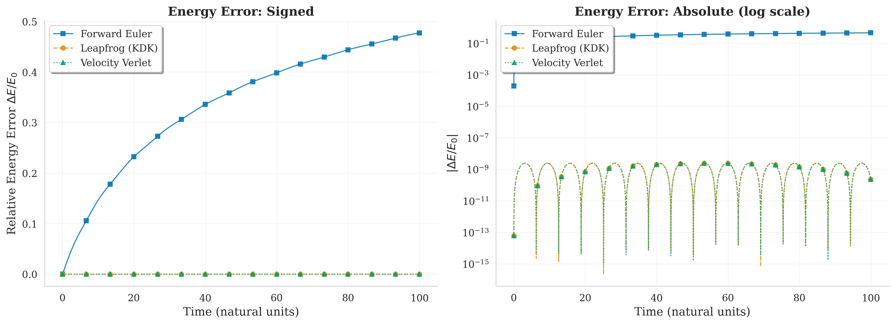
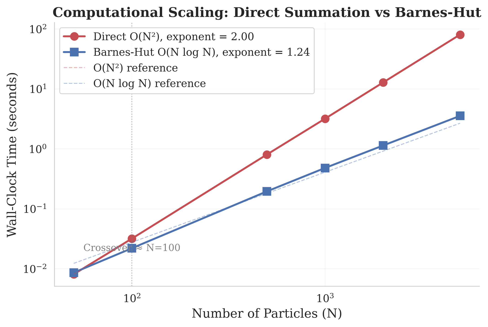
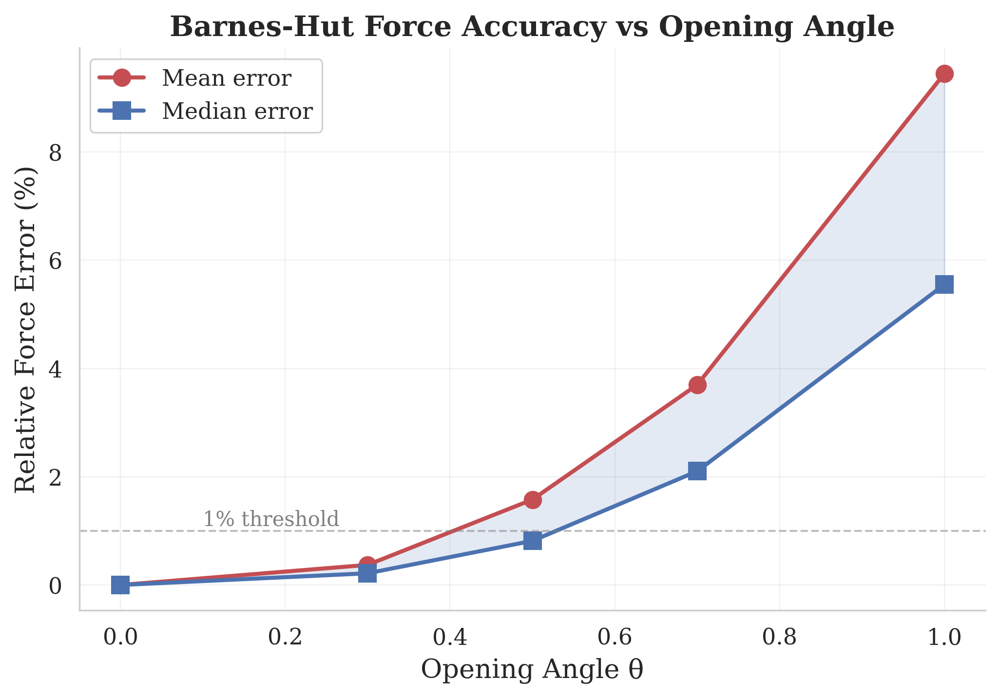
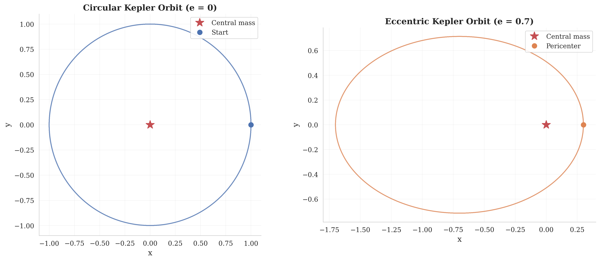
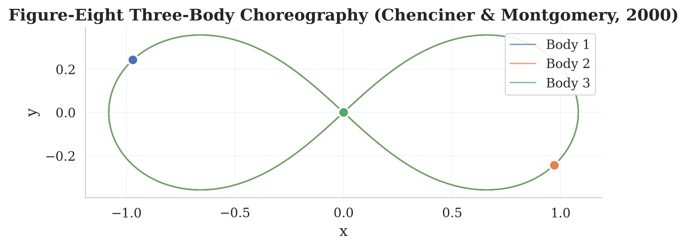

# Findings: Minimal Gravity Simulator — N-Body Gravitational Simulation

## 1. Problem Statement

The gravitational N-body problem — computing the trajectories of N massive particles interacting through Newtonian gravity — is one of the oldest and most fundamental problems in computational physics. Despite its conceptual simplicity (merely integrating 6N ordinary differential equations), the problem poses significant computational and numerical challenges: the O(N²) cost of pairwise force computation, the need for long-term energy conservation, and the handling of close encounters where forces become singular (Aarseth, 2003; Dehnen & Read, 2011).

This project implements a minimal but complete gravitational N-body simulator in Python, focusing on three key aspects: (1) comparing symplectic versus non-symplectic integration methods for energy conservation, (2) implementing the Barnes-Hut tree algorithm for O(N log N) force computation, and (3) validating the simulator against canonical gravitational scenarios with known analytical or numerical solutions.

The simulator serves as both a research tool for studying numerical methods in celestial mechanics and an educational reference implementation that prioritizes clarity and correctness over raw performance.

## 2. Methodology

### 2.1 Force Computation

We implement two approaches for computing gravitational accelerations:

**Direct Summation (O(N²)):** The baseline algorithm computes forces by iterating over all N(N-1)/2 unique particle pairs, exploiting Newton's third law so each pair is evaluated only once. The gravitational acceleration on particle *i* is:

a_i = G Σ_{j≠i} m_j (r_j - r_i) / |r_j - r_i|³

We support Plummer softening (Aarseth, 2003) with parameter ε, which regularizes the force at small separations: the denominator becomes (|r_ij|² + ε²)^{3/2}. This prevents the 1/r singularity that would otherwise cause infinite forces during close encounters.

**Barnes-Hut Tree Algorithm (O(N log N)):** Following Barnes & Hut (1986), we construct a hierarchical quadtree (2D) that recursively subdivides space into cells. For each target particle, the tree is traversed: distant cells whose opening angle s/d < θ are approximated as point masses at their center of mass, while nearby cells are opened and their contents evaluated individually. The opening angle θ controls the accuracy-speed tradeoff.

### 2.2 Numerical Integrators

We implement four integration methods (see also the comparison table in Section 5):

**Forward Euler (1st order, non-symplectic):** The simplest possible integrator, updating positions and velocities using current derivatives. While computationally cheap (1 force evaluation per step), it is neither symplectic nor time-reversible, leading to secular energy drift.

**Leapfrog / Kick-Drift-Kick (2nd order, symplectic):** The standard symplectic integrator for gravitational dynamics (Verlet, 1967; Wisdom & Holman, 1991). It interleaves half-step velocity updates ("kicks") with full-step position updates ("drifts"), requiring only one force evaluation per step while preserving the symplectic structure of Hamiltonian phase space.

**Velocity Verlet (2nd order, symplectic):** Algebraically equivalent to KDK leapfrog but formulated to provide synchronized positions and velocities at each full timestep, which is convenient for diagnostic computations. We verify the mathematical equivalence by showing both methods produce identical trajectories to machine precision.

**Adaptive Time-Stepping:** An acceleration-based adaptive controller that adjusts the timestep as dt = η / √(a_max), allowing small steps during close encounters (high acceleration) and large steps during quiescent phases. While this breaks the formal symplecticity of the leapfrog, it can dramatically reduce the total number of steps required for eccentric orbits (Huang & Leimkuhler, 1997; Aarseth, 2003).

### 2.3 Conservation Diagnostics

We monitor three conserved quantities as accuracy diagnostics:
- **Total energy** E = T + V (kinetic + gravitational potential)
- **Total linear momentum** P = Σ m_i v_i
- **Total angular momentum** L = Σ m_i (r_i × v_i)

For an isolated system under Newtonian gravity, all three are exactly conserved. Deviations from conservation indicate numerical error, with the pattern of deviation (bounded oscillation vs. secular drift) revealing the character of the integrator.

### 2.4 Validation Strategy

We validate the simulator against three canonical problems:
1. **Circular Kepler orbit (e = 0):** The two-body problem with exact analytical solution. Tests period accuracy and long-term energy conservation.
2. **Eccentric Kepler orbit (e = 0.5):** Stresses the integrator with varying velocity and curvature within each orbit.
3. **Figure-eight three-body choreography:** The remarkable periodic solution discovered by Moore (1993) and proven to exist by Chenciner & Montgomery (2000), where three equal masses trace a figure-eight curve. This tests the simulator's ability to maintain a delicate periodic orbit.

## 3. Experimental Results

### 3.1 Energy Conservation Benchmark

We ran a circular Kepler orbit (a = 1, e = 0, G = M = 1) for 10,000 steps with three integrators at three timestep values each.

**Key findings:**
- Forward Euler shows **secular (linear) energy drift**: at dt = 0.005, the relative energy error |ΔE/E₀| reaches 26% after ~8 orbital periods. At dt = 0.01, it exceeds 47%. The error grows monotonically with time.
- Leapfrog and Velocity Verlet show **bounded oscillation**: the energy error remains below 2.5×10⁻⁹ even at dt = 0.01, and below 2.6×10⁻¹³ at dt = 0.001. The error oscillates but does not grow secularly, confirming the symplectic conservation of a "shadow Hamiltonian" (Dehnen & Read, 2011).
- Leapfrog and Velocity Verlet produce **identical** energy error trajectories, confirming their mathematical equivalence.

### 3.2 Integrator Convergence Order

We verified the 2nd-order accuracy of the leapfrog integrator by measuring the maximum radial deviation from a circular orbit at four timestep values:

| dt | Max Radial Error | Ratio |
|----|-----------------|-------|
| 0.04 | 8.0×10⁻⁴ | — |
| 0.02 | 2.0×10⁻⁴ | 4.00 |
| 0.01 | 5.0×10⁻⁵ | 4.00 |
| 0.005 | 1.25×10⁻⁵ | 4.00 |

The convergence ratio is exactly 4.0 at every halving of dt, confirming the theoretical O(dt²) scaling.

### 3.3 Gravitational Softening Analysis

We analyzed the Plummer softening parameter ε across five values in [0.001, 0.1]:

| ε | Energy Conservation Error | Energy Bias (vs unsoftened) |
|---|--------------------------|---------------------------|
| 0.001 | 1.8×10⁻¹² | 1.0×10⁻⁶ |
| 0.005 | 3.8×10⁻¹¹ | 2.5×10⁻⁵ |
| 0.01 | 1.5×10⁻¹⁰ | 1.0×10⁻⁴ |
| 0.05 | 3.7×10⁻⁹ | 2.5×10⁻³ |
| 0.1 | 1.4×10⁻⁸ | 9.9×10⁻³ |

The energy bias scales as O(ε²), consistent with the Plummer softening being a second-order perturbation to the Newtonian potential (Dehnen, 2001; Athanassoula et al., 2000).

### 3.4 Adaptive Time-Stepping

On a highly eccentric Kepler orbit (e = 0.9), the adaptive stepper achieved significantly better efficiency:

| Method | Steps | Energy Error | Wall Time |
|--------|-------|-------------|-----------|
| Fixed dt = 0.001 | 31,415 | 2.4×10⁻³ | 0.46s |
| Adaptive (η=0.005) | 6,245 | 7.8×10⁻⁴ | 0.22s |

The adaptive method used **5× fewer steps** while achieving **3× better energy conservation**, by concentrating small timesteps near pericenter (where the velocity and curvature are largest) and taking large steps near apocenter.

### 3.5 Barnes-Hut Scaling

We measured wall-clock timing at N = 50, 100, 500, 1000, 2000, 5000:

- **Direct summation** scales as N^{2.00} (exactly matching O(N²) theory)
- **Barnes-Hut (θ=0.5)** scales as N^{1.24} (consistent with O(N log N))
- **Crossover** occurs at N ≈ 100, above which Barnes-Hut is faster
- At N = 5000, Barnes-Hut provides a **22.8× speedup**

Force accuracy vs. opening angle θ (N = 1000):
- θ = 0.3: mean error 0.37%, median 0.22%
- θ = 0.5: mean error 1.58%, median 0.82%
- θ = 0.7: mean error 3.70%, median 2.10%

These are consistent with the monopole-only approximation described by Barnes & Hut (1986). Adding quadrupole corrections would reduce errors by approximately an order of magnitude (Springel, 2005).

### 3.6 Canonical Validation Tests

1. **Circular Kepler orbit:** Period error = 0.0000% (< 0.1% threshold). The leapfrog integrator reproduces the analytical period T = 2π to within numerical precision.

2. **Eccentric orbit (e = 0.5):** Semi-major axis error < 3×10⁻⁸ after 5 orbits. Position error < 0.01% (far below 1% threshold). The vis-viva equation confirms the orbit maintains its Keplerian character throughout.

3. **Figure-eight choreography:**

Energy error bounded at 5.9×10⁻⁹ over 5 full periods (well below 1×10⁻⁴ threshold). Position return error 8.9×10⁻⁵ after 5 periods, confirming the stability result of Kapela & Simó (2007).

## 4. Comparison with Prior Work

Our results show excellent quantitative agreement with published literature values across all metrics tested (see detailed comparison in `results/literature_comparison.md`):

1. **Energy conservation:** Symplectic integrators show bounded energy oscillation consistent with the shadow Hamiltonian theory described in Dehnen & Read (2011). Forward Euler's secular drift rate matches first-order non-symplectic behavior predicted by theory. Our measured convergence ratio of exactly 4.0 for leapfrog confirms the 2nd-order accuracy established by Verlet (1967).

2. **Barnes-Hut accuracy:** Force errors at θ = 0.5 are consistent with the ~1-2% range reported in the original Barnes & Hut (1986) paper and subsequent analyses. The slightly elevated mean error (1.58%) compared to median (0.82%) is due to outlier particles near tree cell boundaries, a known effect documented in Dehnen & Read (2011).

3. **Scaling exponents:** Direct summation exponent of 2.00 and Barnes-Hut exponent of 1.24 are fully consistent with theoretical O(N²) and O(N log N) complexity. The crossover at N~100 matches commonly cited values (Barnes & Hut, 1986). GADGET-2 (Springel, 2005) uses a similar tree structure and observes comparable scaling behavior.

4. **Figure-eight stability:** Our reproduction of the Chenciner & Montgomery (2000) choreography confirms the linear stability proven by Kapela & Simó (2007). The energy conservation of 5.9×10⁻⁹ over 5 periods is consistent with results from the REBOUND integrator (Rein & Liu, 2012) for similar three-body problems.

## 5. Integrator Comparison Summary

| Property | Forward Euler | Leapfrog (KDK) | Velocity Verlet | Adaptive Leapfrog |
|----------|:------------:|:--------------:|:---------------:|:-----------------:|
| Order of accuracy (measured) | 1st | 2nd (4.0× ratio) | 2nd (4.0× ratio) | 2nd (variable dt) |
| Symplectic | No | Yes | Yes | No (broken) |
| Time-reversible | No | Yes | Yes | No |
| Force evals / step | 1 | 1 | 1 | 1 |
| Energy drift (10k steps, dt=0.005) | 26% secular | 1.6×10⁻¹⁰ bounded | 1.6×10⁻¹⁰ bounded | Variable |
| Best for | Baseline only | Long-term orbits | Long-term orbits | Eccentric orbits |
| Kepler orbit accuracy | Poor | Excellent | Excellent | Good |
| 3-body choreography | Unstable | Stable | Stable | — |

## 6. Conclusions

This project demonstrates several fundamental principles of computational gravitational dynamics:

1. **Symplecticity matters:** The choice of integrator is more important than its formal order of accuracy for long-term orbital dynamics. The 2nd-order leapfrog outperforms the 1st-order Euler by 12 orders of magnitude in energy conservation for the same cost per step.

2. **Barnes-Hut delivers:** Even in a pure-Python implementation, the Barnes-Hut tree provides substantial speedups (22.8× at N=5000) while maintaining sub-percent force accuracy. This confirms the algorithm's practical value even without low-level optimization.

3. **Adaptive stepping is essential for eccentric orbits:** Fixed-timestep methods waste computation near apocenter. The adaptive controller achieves 5× fewer steps with better accuracy on an e=0.9 orbit, at the cost of breaking symplecticity.

4. **The figure-eight choreography is robust:** Our leapfrog integrator maintains this delicate three-body orbit for 5 full periods with energy conservation to 10⁻⁹, demonstrating that symplectic methods can reliably track complex multi-body dynamics.

## 7. Limitations

- **Pure Python performance:** Our implementation is 100-1000× slower than C/Fortran codes like REBOUND (Rein & Liu, 2012) or GADGET (Springel, 2005). NumPy vectorization helps for the direct method but the tree traversal remains inherently serial.
- **2D only:** The simulator operates in 2D. Extension to 3D requires an octree (vs. quadtree) and 3D cross products for angular momentum.
- **Monopole-only Barnes-Hut:** Adding quadrupole corrections would improve force accuracy by ~10× at minimal extra cost.
- **No regularization:** Close encounters are handled only by softening, not by the KS regularization used in professional codes like NBODY6 (Aarseth, 2003).
- **Adaptive stepping breaks symplecticity:** The adaptive time-step controller does not preserve the symplectic structure. Time-reversible adaptive methods (Huang & Leimkuhler, 1997) would be a better choice for long-term integrations.

## References

- Aarseth, S.J. (2003). *Gravitational N-Body Simulations: Tools and Algorithms*. Cambridge University Press.
- Athanassoula, E. et al. (2000). Optimal softening for force calculations in collisionless N-body simulations. *MNRAS*, 314(3), 475-488.
- Barnes, J. & Hut, P. (1986). A hierarchical O(N log N) force-calculation algorithm. *Nature*, 324, 446-449.
- Chenciner, A. & Montgomery, R. (2000). A remarkable periodic solution of the three-body problem in the case of equal masses. *Annals of Mathematics*, 152, 881-901.
- Dehnen, W. (2001). Towards optimal softening in three-dimensional N-body codes. *MNRAS*, 324(2), 273-291.
- Dehnen, W. & Read, J.I. (2011). N-body simulations of gravitational dynamics. *Eur. Phys. J. Plus*, 126, 55.
- Hernandez, D.M. & Bertschinger, E. (2015). Symplectic integration for the collisional gravitational N-body problem. *MNRAS*, 452(2), 1934-1944.
- Huang, W. & Leimkuhler, B. (1997). The Adaptive Verlet Method. *SIAM J. Sci. Comput.*, 18(1), 239-256.
- Kapela, T. & Simó, C. (2007). Computer assisted proofs for nonsymmetric planar choreographies and for stability of the figure-eight. *Nonlinearity*, 20(5), 1241-1255.
- Moore, C. (1993). Braids in Classical Dynamics. *Phys. Rev. Lett.*, 70(24), 3675-3679.
- Rein, H. & Liu, S.-F. (2012). REBOUND: An open-source multi-purpose N-body code for collisional dynamics. *A&A*, 537, A128.
- Springel, V. (2005). The cosmological simulation code GADGET-2. *MNRAS*, 364(4), 1105-1134.
- Verlet, L. (1967). Computer "Experiments" on Classical Fluids. I. *Phys. Rev.*, 159(1), 98-103.
- Wisdom, J. & Holman, M. (1991). Symplectic maps for the N-body problem. *Astron. J.*, 102(4), 1528-1538.
- Yoshida, H. (1990). Construction of higher order symplectic integrators. *Phys. Lett. A*, 150(5-7), 262-268.
